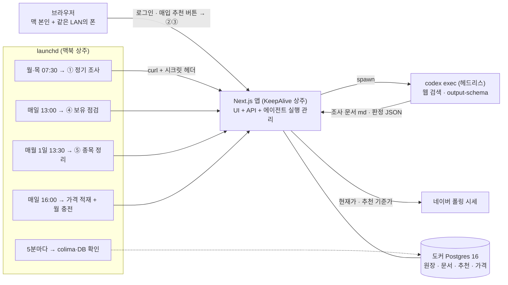

# etf-advisor

매월 정해진 규칙으로 국내 상장 ETF를 적립 매수하기 위한 1인용 웹 앱. 조사·추천은 AI 에이전트(codex CLI)가
하고, 매수는 사람이 증권사 앱에서 직접 한다.

적립식 투자는 규칙 자체는 단순하지만 매달 반복되는 잡일이 많다 — 후보 ETF가 아직 쓸 만한지 확인하고,
잔돈 때문에 남은 카테고리별 잔액을 계산하고, 산 뒤에는 평단가와 수익률을 갱신해야 한다.
이 앱은 그 잡일을 맡는다. 조사와 추천은 codex CLI를 헤드리스로 띄워 웹 검색으로 돌리고,
결과는 고정 형식 문서와 JSON으로 받아 DB에 쌓는다. **자동 매매는 하지 않는다** — 증권사 API에
연결하지 않고, 최종 매수 판단과 주문은 사람 몫이다. 사이트·DB·에이전트 전부 맥북 한 대에서 돌리고
같은 LAN 안에서만 접속한다.

기본 설정(예시): 월 70만 원을 배당성장 50%(35만) · 자산성장 30%(21만) · 고배당 20%(14만)으로 나눠
매월 15~20일에 매수. 금액과 비중은 설정 화면에서 바꾼다.

## 핵심 기능

- **에이전트 5개 파이프라인** — ① 정기 조사(월·목) ② 매입 시점 재조사(버튼) ③ 추천 ④ 보유 점검(매일)
  ⑤ 종목 정리 검토(월간). ①②는 고정 형식 조사 문서를, ③④⑤는 JSON을 낸다.
- **카테고리별 이월 원장** — 1주 단위로만 살 수 있어 매달 남는 잔돈을 카테고리별로 이월한다.
  잔액은 저장 컬럼이 아니라 원장 행의 `SUM`으로 항상 파생된다.
- **추천 → 매입 기록 → 평단가·수익** — 추천 카드에서 확정하면 매입 기록과 잔액 차감이 한 트랜잭션으로
  들어가고, 평단가·보유 현황·수익이 거기서 파생된다.
- **XIRR · TWR · 목표 비중 이탈** — 적립식에 맞는 금액가중수익률(XIRR)을 헤드라인으로 두고,
  시간가중수익률(TWR)과 카테고리별 드리프트를 함께 보여준다.
- **실시간 체결가 기준 추천 + 장 운영시간 가드** — 추천 기준가를 조사 문서 값이 아니라 추천 시점의
  체결가로 갈아끼우고 수량을 다시 센다. 평일 09:00~15:30(KST) 밖에서는 추천 실행을 기본으로 막는다.
- **수집 수치 자가검증** — 에이전트가 모아 온 숫자를 항등식으로 교차 검사한다(분배율 vs 총수익률,
  NAV가 내렸는데 분배율만 높은 조합, 가격 자릿수, 괴리율 범위 등). 실패한 값은 버리지 않고
  '미확정'으로 표시해 사람이 판단하게 한다.
- **돈이 움직이는 경로의 안전장치** — 추천 확정 이중 제출은 DB partial unique로 막고, 갈아타기
  묶음은 매수·매도가 한 트랜잭션이라 하나라도 실패하면 둘 다 취소된다.
- **무인 운영** — launchd가 조사·점검·가격 적재·월 충전을 시각에 맞춰 부르고, 절전에서 깨어나면
  도커·DB를 다시 올린다. 실패는 대시보드와 맥 알림 센터에 드러난다.

## 아키텍처



웹 프로세스와 에이전트 실행이 같은 프로세스라 큐·워커·하트비트가 없다. 동시 실행은
`agent_runs.status='running'` partial unique index로 DB가 강제한다.

| 계층 | 선택 |
|---|---|
| 앱 | Next.js 16 (App Router) · React 19 · TypeScript · Tailwind CSS v4 |
| DB | Postgres 16 (도커/colima) + Drizzle ORM |
| 조사·추천 | codex CLI 헤드리스(`codex exec`) + 웹 검색(`-c tools.web_search=true`), JSON은 `--output-schema`로 강제 |
| 스케줄 | launchd (앱 상주 KeepAlive + 잡 5개) |
| 인증 | argon2 비밀번호 해시(`@node-rs/argon2`) + jose 서명 세션 쿠키 |
| 시세 | 네이버 폴링 API (공식 시세 API는 키가 있을 때만) |

## 설계 결정 하이라이트

**잔액을 저장하지 않는다**
매입을 수정·삭제할 때마다 잔액 컬럼을 같이 고쳐야 하면 언젠가 어긋난다.
그래서 카테고리별 잔액은 `ledger` 행의 `SUM(amount_krw)`으로만 파생하고, 저장 컬럼을 두지 않았다.
매입 insert/수정/삭제와 원장 행은 한 트랜잭션에 묶여 있어, 잔액이 어긋날 방법이 없다.

**적립식의 헤드라인 지표는 XIRR**
`(평가손익 + 분배금) ÷ 매입원금`은 3년 전 납입과 이번 달 납입을 같은 무게로 나눈다.
월 적립 12회 시나리오에서 이 방식은 7.14%, 같은 현금흐름의 XIRR은 14.82%로 절반 수준의 과소표시가 난다
(`check-xirr.ts`의 재현 케이스). 헤드라인을 XIRR로 두고 원금 대비 비율은 참고값으로 남겼다.
다만 이건 "MWR의 정의상 납입 타이밍이 반영된다"는 근거일 뿐 업계 표준이라서가 아니고,
그 사실도 문서에 적어뒀다.

**추천 기준가는 조사 문서가 아니라 실시간 체결가**
조사 문서의 가격은 조사 시점 스냅샷이라 추천 화면에서는 이미 묵은 값이다. 그대로 쓰면 화면의 수량이
증권사 앱에서 안 맞는다. 그래서 정규화 직후 추천 시점의 체결가로 기준가를 갈아끼우고 수량을 다시 센다.
조사 가격은 `research_price`에 남겨 사후 재현이 가능하다. 같은 이유로 장이 닫힌 시간에는 추천 실행을
기본으로 막는다(강행 체크박스는 남겨뒀다).

**이중 제출은 UI가 아니라 DB에서 막는다**
성공 표시가 클라이언트 상태면 새로고침으로 폼이 되살아나고, 렌더 시점 조회는 탭을 두 개 열면 TOCTOU가 남는다.
`purchases.recommendation_id`에 partial unique를 걸어 DB가 거절하게 했다. 갈아타기 추천은 매도→매수가
한 트랜잭션이므로, 유니크 위반이 트랜잭션 전체를 롤백해 매도 기록까지 함께 사라진다.
Postgres 원문이 사용자에게 새지 않도록 `23505`를 한국어 안내 메시지로 변환한다.

**에이전트 출력은 세 겹으로 거른다**
LLM 출력을 그대로 장부에 넣을 수는 없다. ① `--output-schema`로 JSON 필드·타입을 강제하고
② 정규화 단계에서 도메인 규칙으로 거른다(보유하지 않은 티커의 판정은 버리고, 매도 수량이 보유를 넘으면
전량으로 조정하고, 카테고리를 넘나드는 통합 제안은 거부한다) ③ 마지막으로 산술 자가검증을 돌려
범위를 벗어나거나 서로 안 맞는 수치를 '미확정'으로 표시한다. 배정 금액은 아예 모델에게 맡기지 않고
시스템이 잔액으로 덮어쓴다.

**무인 운영의 진짜 적은 알고리즘이 아니라 launchd 환경**
LaunchAgent는 로그인 셸 PATH를 상속하지 않고, `realpath codex`에는 node 버전이 박혀 있어
node를 올리는 순간 조용히 죽는다(실측). 그래서 plist는 고정 경로의 래퍼 스크립트만 가리키고
경로 해석은 래퍼 안에서 한다. 맥이 절전에 들어갔다 나오면 colima VM이 내려가 있는 일이 있고 그러면
앱이 DB에 못 붙어 정기 조사가 조용히 실패하므로, 트리거마다 도커·DB를 먼저 확인한다.
앱이 막 부팅 중일 수도 있어 트리거는 3회 재시도(정기 조사는 5분 간격, 나머지 트리거는 3분 간격)한다.
조사를 빠뜨리는 건 대개 이런 환경 쪽이었다.

## 검증 방식

`web/scripts/`에 검증 스크립트 19종이 있다. 파서·추천 정규화·XIRR·TWR·드리프트·자가검증처럼 순수함수로
끝나는 것은 DB 없이 돌고, 원장·추천 확정·갈아타기·잔액 검증처럼 **돈이 움직이는 경로는 테이블을 비우므로
별도 검증 DB에서만 돌린다**(실데이터가 있으면 스크립트가 실행을 거부한다).
이쪽 스크립트는 "고쳤으니 통과한다"만 보지 않고 **대조군을 같이 넣는다** — 예를 들어 고배당 이전 검증은
수정 전 로직(양수만 집계)을 같은 데이터에 재현해 그쪽에서는 값이 부풀었음을 함께 출력한다.

기획 단계에서는 계획·아키텍처·비판 역할을 나눠 교차 검토했고(보강 기획서 머리말의 검토 이력),
구현 뒤에는 별도 코드 리뷰 지적을 반영했다 — 정적 프리렌더 리다이렉트 루프, 고아 실행 영구 잠금,
파서의 유령 행·통화기호 처리, 서버 액션 세션 검증 등이 거기서 나왔다.

## 실행 방법

```bash
docker run -d --name etf-advisor-db --restart=always \
  -e POSTGRES_USER=etf_advisor -e POSTGRES_PASSWORD=... -e POSTGRES_DB=etf_advisor \
  -p 127.0.0.1:5433:5432 postgres:16

cp web/.env.local.example web/.env.local   # DATABASE_URL / SESSION_SECRET / CRON_SECRET 채우기
pnpm --dir web install
pnpm --dir web run db:push
pnpm --dir web dev --port 3111
```

첫 접속 시 `/setup`에서 비밀번호를 정하고, 온보딩에서 기존 보유 종목과 잔액을 넣는다.
launchd 상주 운영·조사 스케줄·운영 중 점검 명령은 [docs/운영.md](docs/운영.md)에 있다.

## 문서

| 문서 | 내용 |
|---|---|
| [기획서.md](기획서.md) | 투자 규칙·원장 규칙·에이전트 설계·데이터 모델·단계별 계획 |
| [docs/보강-기획서-v1.md](docs/보강-기획서-v1.md) | 첫 실전 사이클 전 진단 — 무엇을 왜 먼저 고쳤는지, 근거와 비용 추정 |
| [docs/프롬프트-시스템-계약.md](docs/프롬프트-시스템-계약.md) | 프롬프트와 시스템 사이의 필드·형식 계약 |
| [docs/운영.md](docs/운영.md) | 상주 운영·스케줄·검증 스크립트·상태 점검 |

## 한계와 안 하는 것

- **1인용이다.** 다중 사용자·회원가입이 없고 비밀번호 하나로 로그인한다.
- **자동 매매를 하지 않는다.** 증권사 API에 연결하지 않으며, 주문은 사람이 증권사 앱에서 직접 낸다.
  이 앱의 출력은 공개 정보의 요약·정리이고 투자 자문이 아니다.
- **공휴일을 판별하지 않는다.** 장 운영시간 가드는 평일 09:00~15:30(KST)만 보므로 공휴일에는 열려 있다.
- **백업 체계가 없다.** 로컬 DB이고, 조사 문서 md 사본이 남는 정도가 전부다.
- **외부에 배포하지 않는다.** 포트포워딩·공인 IP 노출을 하지 않고 맥북과 같은 LAN 안에서만 접속한다.
  HTTPS가 없어 세션 쿠키에 Secure 플래그를 쓰지 않는다 — 사설망 전제에서 수용한 선택이다.
- **세금·ISA 한도를 계산하지 않는다.** 한도 수치를 확정하지 않았기 때문에 아예 다루지 않는다.
- **맥이 꺼져 있으면 그날은 빈다.** 잠자기는 launchd의 wake 보정으로 덮이지만 전원 꺼짐은 보장이 없다.
