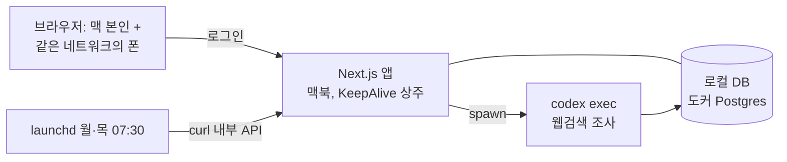

# ETF 월간 매입 도우미 — 기획서

- 상태: **v0.7** (최종 정합성 검토 반영 — 착수 가능)
- 이력: v0.1 초안 → v0.2 비판 검토 → v0.3 사용자 결정 12건 → v0.4 충전=매입 다음날 → v0.5 맥북 단독 호스팅·카테고리별 잔액 이월 → v0.6 에이전트 3개 → **v0.7 원장 규칙 구멍 보완·스키마 정비** (2026-08-27)
- 프로젝트명: `etf-advisor` (확정 — 결정 1)
- 사용자: 이병찬 1인 전용. 결정 원문은 부록 D.

---

## 1. 한 줄 요약

매주 월/목에 맥북의 Codex CLI가 ETF 시장을 조사해 문서로 쌓아두고, 매월 15~20일 매입 시점에 버튼을 누르면 **문서에 등장한 종목 전체를 재조사한 뒤** 그 근거로 카테고리별 매수 종목을 추천하며, 카테고리별 잔액·매입 기록·보유 현황까지 관리하는 1인용 웹사이트. **사이트·DB·에이전트 전부 맥북 한 대에서 호스팅**한다 (결정: Vercel 포기 — 부록 D-3).

## 2. 투자 규칙·잔액 규칙

### 2.1 투자 규칙 (확정)

매월 15~20일 사이에 월 70만 원을 세 카테고리로 나눠 한국 상장 ETF를 매수한다.
계좌는 **한국투자증권 청년형 ISA 중개형**이며, 미국 상장 ETF를 직접 사는 것이 아니라
한국거래소 상장 ETF를 1주 단위로 매수한다 (프롬프트 v1에서 명시된 전제).

| 구분 | 비중 | 월 충전액 | 예시 ETF |
|---|---|---|---|
| 배당성장 | 50% | 35만 원 | SOL 미국배당다우존스 |
| 자산성장 | 30% | 21만 원 | TIGER 미국나스닥100 |
| 고배당 | 20% | 14만 원 | TIGER 미국배당+3%프리미엄 |

- 표의 ETF는 예시. 실제 후보 풀과 선정 기준은 **사용자가 직접 작성하는 프롬프트 3개(§5)가 정의**한다 (결정 4·9).
- 월 충전액·비중은 설정(§6 화면 7)에 저장하며 위 표가 기본값 — 코드 상수로 박지 않는다.
- 실제 매입 시 배정 금액은 **해당 카테고리의 현재 잔액**(이월 포함)이다 — §2.2.

### 2.2 잔액 규칙 (결정 5·12 + 카테고리별 이월 확정)

1주 단위로만 매수할 수 있어 매달 잔돈이 남는다. 이를 **카테고리별 원장**으로 관리한다.

- 잔액은 **카테고리별로 따로** 관리한다 (확정). 배당성장에서 남은 3만 원은 다음 달에도 배당성장 몫 — 카테고리 간 섞이지 않는다.
- **예외 하나**: 고배당을 건너뛴 회차에 한해 그 잔액을 배당성장·자산성장에 5:3으로 배정한다.
  실제 이동은 매입을 기록할 때 모자란 만큼만 일어나고, 안 사면 고배당에 남아 이월된다.
  (고배당은 분배율 6% 이상만 후보라 조건에 맞는 상품이 없으면 건너뛰게 되는데, 그때 돈이 노는 것을 막기 위함)
- 매입할 때마다 **해당 카테고리 잔액**이 매입 금액만큼 차감된다.
- 매월 충전: 각 카테고리에 **남은 잔액 + 월 충전액**(기본 35/21/14만 원)이 새 잔액이 된다.
- 충전 시점: **매입 완료 다음날** (결정). 완료 인지는 **[이번 달 매입 마감]** 버튼 기본안(§12-1).
- 충전 실행은 크론 없이 **lazy 방식**: 앱이 요청을 받을 때 조건을 검사해 충전 행을 삽입한다. 상주 서버라 별도 스케줄러 불필요.

**원장 세부 규칙** (구현 착수를 막던 구멍 — v0.7에서 확정):

1. **month의 정의**: topup 행의 `month` = **그 돈이 쓰일 매입 대상 달**. 마감 다음날 충전되는 topup의 month = 마감 달 + 1. 예: 8/20 마감 → 8/21 충전, `month='2026-09'`. *(v0.7의 "마감이 속한 달" 정의는 온보딩 시딩과 유니크 키가 충돌해 다음 달 충전이 막히는 버그가 있어 v0.8에서 정정)*
2. **초기 시딩**: 온보딩에서 ① 카테고리별 **현재 잔액**(실제 증권사 예수금 기준 — 이번 달 몫이 이미 포함된 값)을 `adjust`로 시딩 ② 기존 보유 종목(수량·평단가)을 `purchases`로 입력(원장 차감 없음 — ①의 잔액에 이미 반영된 과거) ③ 시딩한 달을 `baseline`으로 settings에 기록.
3. **거른 달 보정 (기본안 — §12-5)**: 요청 시 lazy로 `max(마지막 topup month, baseline)` **다음 달부터 당월까지** 누락 topup을 전부 채운다(누적). 마감을 잊어도 다음 달 1일부터는 자동 충전되고, 마감하면 다음날로 앞당겨 충전된다(마감 달+1 topup 삽입). 매입을 한 달 걸러도 그 달 70만이 소실되지 않는다 — 소실이 의도라면 §12-5에서 뒤집을 것.
4. **adjust 용도**: 초기 시딩과 수기 보정 전용 (일상 흐름은 topup/purchase 두 가지뿐).
5. **멱등**: topup은 `(month, category)` 유니크(partial unique, `WHERE type='topup'`). `month`는 topup 행에만 채우고 purchase/adjust는 NULL — 같은 달 두 번째 매입이 제약에 막히는 일 없음.

## 3. 범위

**하는 것**
- 매주 월/목 정기 조사 → 표준 형식 문서로 저장·축적
- 매입 시점: 문서 등장 종목 + 보유 종목 전체 재조사 → 축적 문서와 함께 **종목 추천** (카테고리별 종목·금액·근거·출처)
- 추천 이력 관리
- **매입 기록·카테고리별 잔액·보유 현황** (결정 5): 매입 입력 → 평단가 자동 계산 → 종목별 보유수량·평단가·현재금액·배당금 예상액
- 단일 사용자 로그인 (집 안 네트워크라도 로그인 필수)

**안 하는 것 (결정 포함)**
- ❌ 자동 매매 — 실제 매수는 증권사 앱에서 직접. 증권사 API 미연동.
- ❌ **외부 공개** — 포트포워딩·공인 IP 노출 금지. 접근은 맥북 본인 + 같은 네트워크(집 와이파이)의 폰까지. 밖에서 접속이 필요해지면 그때 Tailscale류 VPN(후순위).
- ❌ 매입 기간(15~20일) 알림 (결정 8)
- ❌ 백업 체계 (결정 10 — 로컬 DB이므로 Time Machine이 켜져 있다면 공짜로 커버되는 정도로 충분)
- ❌ 카테고리 간 자금 이동·리밸런싱 전용 기능 (결정 9의 "프롬프트로 조절"은 **카테고리 안에서 종목을 갈아타는 제안** 수준 — 비중 변경은 설정에서)
- ❌ 실시간 시세 연동, 다중 사용자, 회원가입

**후순위 (다 만든 뒤 — 결정 7)**
- 조사 실패·OAuth 만료 알림 채널 (그 전까지는 대시보드 표시로 대체)

## 4. 전체 구조 — 맥북 단일 서버



- Next.js 앱 하나가 UI + API + 에이전트 실행 관리를 전부 담당한다. **웹 프로세스와 에이전트 실행이 같은 프로세스**라 큐·워커·하트비트가 필요 없다.
- 조사·추천의 두뇌는 Codex CLI(ChatGPT Max 플랜, OAuth) 헤드리스 외부 프로세스. LLM API 과금 없음.
- DB는 맥북 로컬 도커 Postgres (기본안 — §12-4).

## 5. 에이전트 설계 (총 3개)

정기 조사는 시기마다 다루는 종목이 달라질 수 있다. 그래서 매입 시점에는 **그동안 문서에 등장한 종목 + 현재 보유 종목을 전부 모아 같은 기준선에서 한 번에 최신화**하는 별도 조사가 필요하고, 추천은 그 결과를 보고 한다. 프롬프트는 에이전트별로 3개(①·②·③), 전부 사용자가 작성·수정한다(결정 4·9).

공통 실행 명령 형태 (이 맥북에서 검증됨 — 부록 A):

```bash
codex exec --skip-git-repo-check -o <출력파일> "<프롬프트>"
```

### 5.1 에이전트 ① — 정기 조사 (월/목)

| 항목 | 내용 |
|---|---|
| 역할 | 시장 전반 + 후보 ETF 발굴·동향 조사 → 표준 문서 생성 → DB 저장 |
| 트리거 | launchd 매주 **월/목 07:30 KST** (결정 2) — curl로 localhost API 호출(시크릿 헤더, 5분 간격 3회 재시도) |
| 실행 방식 | `codex exec` 헤드리스 + **웹 검색** (결정 11 — 활성화 방법은 M0 go/no-go, 부록 A) |
| 프롬프트 ① | 사용자 작성. 시스템이 출력 형식 지시(§5.4)를 자동으로 뒤에 결합 — **사용자는 조사 내용만 쓰면 됨** |
| 출력 | 표준 문서(§5.4, type: scheduled) — DB 저장 + 맥 로컬 md 사본 유지 |

### 5.2 에이전트 ② — 매입 시점 조사 (온디맨드)

| 항목 | 내용 |
|---|---|
| 역할 | 대상 종목 **전체**를 매입 시점 기준으로 일괄 재조사 (현재가·최근 분배금·분배율·괴리율·직전 이벤트) |
| 트리거 | 웹 UI의 "매입 추천" 버튼 — 추천(③)에 앞서 1회 |
| 대상 수집 | **시스템이 자동으로**: 주입 창(§5.3) 문서들의 frontmatter `tickers` ∪ 문서 ##4 표의 ticker **∪ 현재 보유 종목(보유수량>0)** — 중복 제거 후 프롬프트에 주입. 보유 종목을 넣지 않으면 최근 조사에서 빠진 보유 종목의 현재가가 조용히 낡는다 |
| 실행 방식 | ①과 동일 — `codex exec` + **웹 검색** (M0 게이트에 ①과 함께 걸림) |
| 프롬프트 ② | 사용자 작성 (①과 **별도** — 발굴이 아니라 "이 종목들을 전부 점검하라"가 임무). 시스템이 종목 목록 + 출력 형식 지시(§5.4)를 자동 결합 |
| 출력 | 표준 문서(§5.4, type: ondemand) — **문서 ##4 표에 대상 종목 전원이 빠짐없이 포함**되어야 함 (추천·보유 현황의 기준선) |

### 5.3 에이전트 ③ — 추천

| 항목 | 내용 |
|---|---|
| 역할 | 축적 조사 문서 + ②의 매입 시점 조사를 근거로 카테고리별 매수 종목 추천 |
| 트리거 | "매입 추천" 액션에서 ② 완료 직후 순차 실행 |
| 입력 | 주입 창 문서(아래 규칙) + **②의 신규 문서 전문(상한 예외, 항상 포함)** + 비중 설정 + **카테고리별 현재 잔액** |
| 프롬프트 ③ | 사용자 작성 — 종목 선정 기준·카테고리 내 갈아타기 제안 여부 등 조절 (결정 9) |
| 출력 | 카테고리별 {종목, 참고 수량, 근거, 근거 문서, 출처 URL} — `--output-schema`로 **JSON 강제**, 파싱 실패 시 run을 failed 처리 |

**③의 계약** (프롬프트가 사용자 자유 작성이므로 시스템이 검증하는 최소 규칙):
- 주입 창: `마지막 purchases.bought_at < doc_date ≤ 지금`. 첫 달(매입 기록 없음)은 최근 1개월치 폴백(§12-3). 상한 12건 — 초과 시 오래된 문서는 문서 ##1 요약만 주입. ②의 문서는 상한과 무관하게 전문 포함.
- **배정 금액은 ③이 정하지 않는다** — 시스템이 카테고리별 현재 잔액을 주입하고, 그 값이 곧 배정 금액이다. `recommendations.budget_krw`에는 그 시점 잔액 스냅샷을 시스템이 기록.
- **카테고리당 종목 정확히 1개**를 반환한다. 참고 수량 = ⌊카테고리 잔액 ÷ ②가 조사한 가격⌋ (참고치 — 최종 확인은 증권사 앱, 결과 화면 고정 문구).
- **1주도 못 사는 잔액**(잔액 < 최저가 후보 1주)이면 그 카테고리는 "이번 달 건너뜀 — 잔액 이월"을 반환한다 (이월 설계의 원래 존재 이유).
- run 단위: 매입 추천 액션 1회 = `agent_runs` 2행(② + ③), 같은 `action_id`로 묶어 UI에서 하나의 흐름으로 표시. ①의 action_id는 NULL.

### 5.4 조사 문서 표준 형식 (①·② 공통)

추천 에이전트가 과거 문서를 기계적으로 발췌할 수 있도록 **frontmatter + 고정 헤딩 7개**를 강제한다.

```markdown
---
run_id: ...
date: 2026-09-15
type: scheduled | ondemand
tickers: [조사 대상 코드 배열]
model: ...
---
## 1. 요약            (3줄 이내)
## 2. 시장 개관        (지수·환율·금리 표)
## 3. 카테고리별 ETF 현황 (배당성장/자산성장/고배당 하위 헤딩)
## 4. 데이터 표        (기계 파싱용 단일 표: ticker|name|category|price|dist_yield|premium|note)
## 5. 이벤트·뉴스      (날짜 명기 bullet)
## 6. 리스크 신호      (없으면 "없음" 명기)
## 7. 출처            (수치마다 근거 URL)
```

- 이 기획서의 §번호와 혼동을 피하기 위해, 조사 문서 내부 헤딩은 본 문서에서 **문서 ##N**으로 표기한다.
- 사람용 산문(##1·2·3·5·6)과 기계용 표(##4)를 분리. 헤딩 문구와 표 컬럼은 코드 상수로 고정.
- 문서 ##4 표는 보유 현황의 현재가·분배율 소스로도 쓰인다(§6). 형식 미준수(파싱 실패) 문서는 저장은 하되 대시보드에 경고 표시.
- 문서 제목은 `{type} {doc_date}`로 자동 생성 (frontmatter에 title 없음).

### 5.5 실행 파이프라인 (단일 프로세스, 큐 없음)

1. 트리거 두 갈래(launchd curl / 웹 버튼)가 모두 앱 API로 수렴한다.
2. API는 `agent_runs`에 `running` 행이 있으면 **즉시 거절** — 동시 실행 1개 제한. 정기 조사가 매입 추천과 겹쳐 거절되면 launchd curl 재시도(5분×3회)로 대부분 흡수되고, 소진되면 그 회차는 건너뛰며 대시보드의 "마지막 정기 조사" 날짜로 드러난다. 단일 프로세스라 앱 잠금으로 충분하지만, 안전벨트로 `status='running'` 최대 1행 partial unique index도 건다.
3. 실행 전 프리플라이트 `codex login status` — 실패 시 `status=auth_failed`로 기록 (OAuth 만료가 가장 흔한 장애라 원인이 대시보드에서 바로 보여야 함)
4. `child_process.spawn`으로 `codex exec` 실행. stdout/stderr는 로컬 로그 파일로 스트림 — 같은 머신이라 UI가 로그 tail을 바로 읽는다.
5. 종료 시 exit_code·finished_at 갱신. 하드 타임아웃 15분 초과 시 kill → `timeout`
6. UI는 3~5초 폴링으로 실행 상태 + 로그 tail 표시
7. 서버 시작 시 남아 있는 `running` 행을 `failed`로 일괄 정리 (재시작 고아 방지)
8. 실행 이력 화면에서 실패한 정기 조사를 **수동 재실행** 가능 — 이때 trigger는 user지만 agent는 ①이므로, 에이전트 구분은 trigger 조합 추론이 아니라 **`agent` 컬럼**(weekly|purchase|recommend)으로 명시한다(§7).

## 6. 웹사이트 기능 명세

| # | 화면 | 내용 |
|---|---|---|
| 1 | 로그인 | 비밀번호 1개. rate limit + 실패 로그 (§9) |
| 2 | 대시보드 | **카테고리별 잔액**, **보유 현황 표**, 마지막 정기 조사 상태, 이번 달 매입·마감 여부, [매입 추천 받기] |
| 3 | 조사 문서 | 목록 + 뷰어. scheduled/ondemand 구분 |
| 4 | 매입 추천 | 버튼 → 진행 상태(② 조사 중 → ③ 추천 중, 로그 tail) → 결과: 카테고리별 카드(종목·배정 금액·참고 수량·근거·근거 문서 링크·출처) + "참고치, 최종 확인은 증권사 앱" 고정 문구 |
| 5 | 매입 기록 | 종목별 매입 입력(종목·카테고리·수량·**매입 가격**·일자) → 해당 카테고리 원장 자동 차감 + **평단가 자동 계산**. **[이번 달 매입 마감]** 버튼(다음날 충전 — §2.2). 이력·월별 내역. 입력 수정·삭제 시 연결 원장 행을 같은 트랜잭션에서 함께 수정·삭제 |
| 6 | 실행 이력 | agent_runs 목록, 실패 run 로그 확인, 실패 정기 조사 재실행 |
| 7 | 설정 | 월 충전액·비중, **프롬프트 3개 편집**(①/②/③), 조사 스케줄 시각 표시 |
| 8 | 온보딩(최초 1회) | 비밀번호 설정 안내, 기존 보유 종목(수량·평단가)·기존 잔액 입력 → 초기 시딩(§2.2-2) |

보유 현황 계산식 (**(category, ticker) 단위 집계** — 같은 티커를 두 카테고리에서 사면 따로 표시. 전부 파생, 저장하지 않음):
- 보유수량 = Σ qty / 평단가 = Σ(qty × 매입가) ÷ Σ qty
- 현재금액 = 보유수량 × **최신 조사 문서 ##4 표의 가격** (참고치 — 조회 시점 함께 표시, §12-2). 최신 표에 없는 티커는 마지막으로 등장한 문서의 가격 + 그 날짜 표시(폴백)
- 배당금 예상액(연) = 현재금액 × 최신 dist_yield (참고치)
- **현재금액·배당금 예상액은 조사 문서가 생기는 M2부터 활성** — 그 전에는 `-` 표시 (M1은 수량·평단가까지)

## 7. 데이터 설계 (로컬 DB — 기본안: 도커 Postgres + Drizzle)

- `agent_runs` — id, action_id(②③ 묶음, ①은 NULL), **agent(weekly|purchase|recommend)**, trigger(schedule|user), status(running|done|failed|auth_failed|timeout), log_path, started_at, finished_at, exit_code ※ `running` 최대 1행 partial unique index(§5.5). 큐가 없으므로 queued 없음
- `research_docs` — id, run_id FK, doc_date, type(scheduled|ondemand), title(`{type} {doc_date}` 자동), **content(전문)**, created_at ※ 맥 로컬 md 사본도 유지
- `recommendations` — id, run_id FK, created_at, month, category, ticker, etf_name, budget_krw(그 시점 카테고리 잔액 스냅샷), **ref_price, ref_qty**(②의 조사 가격·참고 수량 스냅샷 — 사후 재현용), rationale, source_doc_ids(json), **source_urls(json)**
- `purchases` — id, bought_at, category, ticker, etf_name, qty, unit_price, amount_krw, recommendation_id FK(nullable), memo
- `ledger` — id, ts, type(topup|purchase|adjust), **category**, amount_krw(±), month(**topup에만 채움**, partial unique `(month, category) WHERE type='topup'`), ref_purchase_id, memo
  - **카테고리별 잔액 = 그 카테고리 행의 `SUM(amount_krw)`로 항상 파생** (저장 컬럼 없음 — 매입 수정·삭제 시 원장 행을 같은 트랜잭션에서 함께 고치면 어긋날 방법이 없다)
  - 월 충전 = 설정의 카테고리별 충전액으로 3행 삽입 (리터럴 상수 아님 — §2.1)
  - purchase insert/수정/삭제와 원장 행은 한 트랜잭션
- `purchase_cycles` — month(유니크), closed_at ※ [매입 마감] 버튼이 기록. lazy 충전(§2.2)의 트리거
- `settings` — key, value_json, updated_at ※ 월 충전액·비중 등 (§2.1 기본값으로 시딩)
- `prompts` — slot(weekly|purchase|recommend), body, updated_at ※ 프롬프트 3개 (§6 화면 7)

## 8. 기술 스택

| 계층 | 선택 | 근거 |
|---|---|---|
| 앱 | Next.js (App Router, TS), pnpm — 맥북 상주 | 프론트+API 한 프로세스, 1인 유지보수 최소. 익숙한 Node/pnpm |
| DB | *(기본안)* **도커 Postgres** + Drizzle ORM | 사용자 선호(도커). 컨테이너 `restart=always` + Docker Desktop 자동 시작 전제(§10). 더 단순한 대안: SQLite — §12-4 |
| 조사/추천 | Codex CLI `codex exec` + 웹 검색 (결정 11) | ChatGPT 계정 재사용, API 과금 없음. **Max 플랜 구독**이라 주 2회+온디맨드 사용량 여유 |
| 스케줄 | launchd (맥) — 정기 조사. 충전은 lazy(§2.2)라 스케줄러 불필요 | launchd는 잠자기 중 놓친 실행을 wake 시 보정 (부록 B) |

Python은 서버에 섞지 않는다 — 조사 로직이 codex 외부 프로세스라 낄 자리가 없고, 런타임 두 개 관리가 1인 운영의 최대 비용.

## 9. 보안·접근 (로컬 전제)

- **원칙(확정)**: 포트포워딩·공인 IP 노출 금지. 접근은 맥북 본인 + 같은 네트워크(집 와이파이)의 기기까지.
- **LAN 접속 전제**: 앱은 `0.0.0.0` 바인딩, macOS 방화벽에서 node 수신 허용, 폰에서는 `http://<맥IP 또는 맥이름.local>:포트`로 접속 — M1 완료 기준("폰에서 로그인")의 전제 조건.
- **인증**: 단일 비밀번호(argon2 해시. *구현 변경: `.env` 대신 `settings` 테이블에 저장 — 최초 접속 시 `/setup` 화면에서 직접 정하게 해 수동 해싱 단계를 없앰*) + 서명된 세션 쿠키(HttpOnly·SameSite=Lax, 30일 슬라이딩). 집 안이라도 로그인 필수(사용자 결정). HTTPS가 없으므로 Secure 플래그는 뺀다 — 로컬/사설망 전제라 수용.
- **rate limit**: 상주 단일 프로세스이므로 메모리 기반으로 충분 (5회/분 실패 시 지연). 실패 로그는 서버 로그 파일로 (DB 테이블 불요).
- 비밀·토큰(`.env`, codex 인증, DB 접속 정보)은 git에 넣지 않는다.
- 외부(밖) 접속이 필요해지면 Tailscale류 VPN을 얹는다 — 그때도 포트포워딩 금지 (후순위, §3).

## 10. 맥북 운영

- LaunchAgent 2개를 `~/Library/LaunchAgents/`에 설치:
  1. **앱 감독**: Next.js 앱을 `KeepAlive` + `RunAtLoad`로 상주 — 부팅 후 자동 시작, 크래시 후 자동 재시작
  2. **정기 조사**: `StartCalendarInterval = [{Weekday=1, Hour=7, Minute=30}, {Weekday=4, Hour=7, Minute=30}]` → curl로 localhost API 호출(시크릿 헤더, 5분 간격 3회 재시도 — 앱이 막 부팅 중일 때 대비)
- **launchd 환경 함정**: LaunchAgent는 로그인 셸 PATH를 상속하지 않는다. plist는 **고정 경로의 래퍼 셸 스크립트**(`scripts/run-agent.sh` — "워커"는 없는 구조이므로 이름 주의)만 가리키고 codex/node 경로 해석은 래퍼 안에서 한다 + `WorkingDirectory`, `StandardOutPath`/`StandardErrorPath` 지정. 절대 경로를 plist에 직접 박으면 안 되는 이유(실측): `realpath codex`가 `~/.local/share/fnm/node-versions/v24.19.0/…`로 **node 버전이 경로에 박혀 있어** fnm으로 node를 올리는 순간 조용히 죽는다.
- **도커 DB**: Docker Desktop 로그인 시 자동 시작 + 컨테이너 `restart=always`. 앱 시작 시 DB 연결 실패면 재시도 후 명확히 에러 표시 (도커가 안 떠 있는 경우가 이 구성의 흔한 첫 장애 — SQLite 대안이면 이 걱정 자체가 없음, §12-4).
- **잠자기**: 정기 조사는 launchd wake 보정으로 그날 맥을 깨우면 실행됨(부록 B). 전원 꺼짐 중 놓친 실행은 보장 없음. **사이트 접속도 맥이 깨어 있어야 가능**. 상시 대기를 원하면 충전기 연결 + `pmset -c sleep 0`(root). 덮개 닫힘 상태 유지는 man에 보장 근거 없음 — 덮개 열림/외장 모니터 전제.
- 대시보드에 "마지막 정기 조사: X월 X일 성공/실패"를 항상 표시해, 조용히 빠진 조사를 바로 알아챈다.

## 11. 리스크

| 리스크 | 대응 |
|---|---|
| **LLM 수치 환각** — 가격·분배율 오류가 추천·보유현황에 반영 | 출처 URL 강제, 모든 파생 수치에 "참고치·조회시점" 표기, 근거 문서 링크 병기, 최종 확인은 증권사 앱 |
| **웹 검색 활성화 실패** — 재실측상 관련 플래그 전부 deprecated/disabled. **①·② 두 에이전트가 함께 무너짐** | M0 go/no-go 게이트(§13) — 막히면 조사 수단 재설계가 선행 |
| **Codex OAuth 만료** (가장 흔한 장애) | 프리플라이트 → `auth_failed` 구분 기록(§5.5), 대시보드 표시. 알림은 후순위(결정 7) |
| **맥북 잠자기/꺼짐** — 조사 누락·사이트 접속 불가 | launchd wake 보정 + 대시보드 상태 표시(§10). 단일 머신 구조의 수용된 제약 |
| **도커 데몬 다운** — DB 접속 불가 | 자동 시작 + `restart=always` + 명확한 에러 표시(§10). 근본 회피는 SQLite 대안(§12-4) |
| **원장 정합성** | topup partial unique 멱등키, purchase+원장 단일 트랜잭션, 잔액 항상 SUM 파생, 초기 시딩·거른 달 보정 규칙(§2.2), 마감 안 된 채 다음 매입창이 오면 대시보드 경고 |
| **데이터 유실** — 백업 불요 결정(10) | 수용. 무비용 완화: 조사 md 로컬 사본 유지 + Time Machine이 켜져 있으면 자연 커버 |
| **추천 과신** | 근거·출처 항상 병기, 사람이 검증하는 루프 유지 |

## 12. 남은 확인 사항 (기본안 — 이의 없으면 이대로 진행)

1. **매입 마감 방식** — 충전 시점 "매입 완료 다음날"은 결정됨. 완료 인지 방법으로 **[이번 달 매입 마감] 버튼**이 기본안
2. **현재가·분배율 소스** — 기본안: 최신 조사 문서의 ##4 데이터 표 (참고치, 조회 시점 표기)
3. **첫 달 문서 주입 폴백** — 기본안: 매입 기록이 없으면 최근 1개월치
4. **DB** — 기본안: 도커 Postgres (사용자 언급 반영). 참고: SQLite면 도커 데몬 의존이 사라져 더 단순
5. **매입을 거른 달의 충전** — 기본안: **누적** (다음 충전 때 밀린 달 몫까지 채움 — 월 70만 적립 의도로 해석). 거른 달 몫을 버리는 게 의도면 말할 것

## 13. 단계별 개발 계획

| 단계 | 내용 | 완료 기준 |
|---|---|---|
| **M0. 검증 스파이크 (go/no-go)** ✅ 완료 | ① **웹 검색 게이트**: `-c tools.web_search=true` → `codex exec --enable standalone_web_search` → 샌드박스 네트워크 허용(`-s`) + 프롬프트 curl 조사(플랜B) 순으로 실측 — **전부 실패하면 조사 수단 재설계가 선행** ② 도커 Postgres 기동 + launchd 래퍼로 codex 1회 실행 | 출처 URL 붙은 조사 md 1개가 **launchd 환경에서** 생성됨 + 앱(또는 스크립트)에서 도커 Postgres 연결 성공 |
| **M1. 뼈대 + 가계부** ✅ 완료 | 로그인, 온보딩(초기 시딩), 카테고리별 원장(마감→lazy 충전·거른 달 보정), 매입 기록 입력·수정·삭제, 보유 현황(**수량·평단가까지**) — 에이전트 없이 완결되는 부분 먼저 | 폰(같은 와이파이)에서 로그인해 매입을 입력하면 카테고리 잔액·평단가가 맞게 움직임 |
| **M2. 정기 조사** ✅ 완료 | 조사 파이프라인 + launchd 월/목 + 앱 감독 LaunchAgent + 문서 뷰어 + 실행 이력·재실행 + 프롬프트 저장·편집 | 월/목 문서가 자동으로 쌓이고 실패가 대시보드에 보임. 보유 현황의 현재금액·배당 예상 활성화 |
| **M3. 추천** ✅ 완료 | 매입 추천 흐름(②→③) + 결과 화면 + 프롬프트 ②③ 편집 + 추천→매입기록 확정 | 버튼 한 번으로 추천+근거+출처, 카테고리별 잔액 기반 배정 반영 |
| **M4. 마감** ✅ 완료 | 실패 알림(맥 알림 센터), 표시 다듬기 | 남은 것은 사용자 프롬프트 주입과 실사이클 1회 |

## 14. 부록

### A. Codex CLI 검증 사실 (이 맥북에서 2026-08-27 실측)

- 설치: codex-cli **0.150.0**, 로그인: **ChatGPT OAuth** (`codex login status` → "Logged in using ChatGPT"), Max 플랜 구독(결정 11)
- 헤드리스: `codex exec [OPTIONS] "프롬프트"` — git 레포 밖에서는 `--skip-git-repo-check` 필요
- 출력 캡처: `-o/--output-last-message <FILE>`, `--json`(JSONL), `--output-schema <FILE>`(JSON 스키마 강제 — ③이 사용). 모델 지정: `-m/--model`
- ✅ **웹 검색 해결 (M0 통과, 2026-08-27 실측)**: `codex exec -c tools.web_search=true "…"` 가 **실제로 동작한다**. `codex features list`의 deprecated/disabled 표시와 무관하게 exec가 web search를 호출했고(로그에 `web search: …` 이벤트), 출처 URL이 붙은 실제 시세를 반환했다. `--search`는 여전히 exec에 없음(exit 2). **launchd 환경에서도 성공** — 래퍼 스크립트로 PATH를 잡으면 동일하게 동작

### B. launchd / 전원 검증 사실 (man 페이지 근거)

- `StartCalendarInterval` 배열로 월·목 각각 지정 가능. Weekday는 "0 and 7 are Sunday" → 월=1, 목=4. Day 키와 같이 쓰면 OR로 묶이므로 같이 쓰지 말 것
- 잠자기: "Unlike cron which skips job invocations when the computer is asleep, **launchd will start the job the next time the computer wakes up.** ... coalesced into one event" (man launchd.plist)
- 전원 꺼짐 중 놓친 실행의 부팅 후 보정은 man에 언급 없음 → 보장 없다고 간주
- 사용자 권한 작업은 `~/Library/LaunchAgents/`의 **LaunchAgent**
- `pmset repeat`의 요일 문자열은 MTWRFSU (월목 = "MR") — **현재 설계에서는 미사용** (전원 꺼짐 보정이 필요해지면 참고)

### C. 폐기된 검토 이력 (참고)

- v0.3~0.4에서 Vercel 배포 + 호스팅 DB를 검토했다가 **맥북 단독 호스팅 결정으로 폐기**. 당시 확인 사실(웹, 2026-08-27): Vercel Hobby 크론은 하루 1회 최대·±59분 지연 / Neon Free는 100 CU-h/월이라 상주 폴링 구조에 부족 / Supabase Free는 상시 인스턴스라 적합했음. 나중에 외부 접속이 다시 필요해지면 이 이력 참조.

### D. 사용자 결정 원문 (2026-08-27, 대화에서 확정)

| # | 결정 |
|---|---|
| 1 | 프로젝트명 `etf-advisor` |
| 2 | 정기 조사 월/목 07:30 KST |
| 3 | ~~Vercel 배포·외부 접속~~ → **재결정: 전부 맥북 호스팅** (외부 공개 안 함, DB는 로컬 도커) |
| 4 | 후보 ETF 풀·조사 내용은 사용자가 프롬프트로 직접 작성 |
| 5 | 매입 기록 확정 — 잔액(잔돈 이월), 매입가 입력→평단가 자동, 보유수량·평단가·현재금액·배당금 예상액 표시 |
| 6 | 추천 시 문서 주입 범위 = 전달 매입 후 ~ 매입 당시 |
| 7 | 실패 알림은 다 만들고 나서 (후순위) |
| 8 | 매입 기간(15~20일) 알림 안 함 |
| 9 | 리밸런싱은 프롬프트로 조절 (카테고리 내 종목 교체 수준) |
| 10 | 백업 불요 |
| 11 | ChatGPT Max 플랜 구독, codex 웹서치 활성화 |
| 12 | 매입 시 잔액 차감, 매월 "남은 잔액+70만"으로 재충전 |
| 추가 | 충전 시점 = 매입 완료 다음날 / **잔액은 카테고리별 이월** / **에이전트 3개** (매입시점 조사를 별도 프롬프트로 분리) |

## 14-E. 구현 결과 (2026-08-27)

기획 대비 달라진 점과 실제 배치. 코드는 `web/`, 운영 스크립트는 `scripts/`.

| 항목 | 구현 |
|---|---|
| 접속 | `http://192.168.0.197:3111` (같은 와이파이). 앱은 `com.etf-advisor.web` LaunchAgent가 KeepAlive 상주 |
| 정기 조사 | `com.etf-advisor.research` LaunchAgent가 월·목 07:30에 `scripts/trigger-research.sh` 실행 → `POST /api/cron/research`(시크릿 헤더) → 5분 간격 3회 재시도 |
| 비밀번호 | *기획 변경*: `.env` 대신 `settings` 테이블. 최초 접속 시 `/setup`에서 직접 정함 (수동 해싱 단계 제거) |
| 로그인 실패 제한 | *기획 변경*: DB `login_attempts` 테이블 대신 메모리(5회/분). 상주 단일 프로세스라 충분하고 테이블 무한 증식 문제가 사라짐 |
| 웹 검색 | `codex exec -c tools.web_search=true` — M0에서 실동작 확인 |
| 프롬프트 | `prompts` 테이블. 미입력 시 자리표시자가 쓰이고 UI에 경고 표시. 출력 형식 지시문은 시스템이 자동 결합 |
| 동시 실행 | `agent_runs`의 `status='running'` partial unique index로 DB가 강제. 겹치면 409 |
| 추천 → 매입 | 추천 카드의 [샀음 — 기록하기]로 매입 기록·잔액 차감이 한 번에 |
| 알림 | macOS 알림 센터(osascript). 조사 실패·OAuth 만료 시 |
| 실행 복구 | 서버 시작 시 고아 `running` 행 자동 정리(`instrumentation.ts`) + 20분 넘게 멈춰 있으면 `/runs`에 [막힌 실행 해제] 버튼 |
| 프롬프트 미입력 시 | 자리표시자가 대신 쓰이고 추천·설정 화면에 경고 배지 표시 |

**검증 현황 (2026-08-27)**: 실제로 돌려서 확인한 것 — 정기 조사 1회(9종목 시세·분배율 수집, 형식 위반 0), 추천 흐름 1회(②→③, 카테고리별 24/7/15주 산출, 출처 URL 포함), 원장 로직 14케이스, 문서 파서 27케이스, launchd 월·목 등록, KeepAlive 자동 재시작, 크론 409/401, 잘못된 문서 id 404. 코드 리뷰 2회분 지적(critical 2·major 7 포함)을 전부 반영.

## 15. 면책·원칙

이 시스템의 추천은 LLM이 수집한 공개 정보의 요약·정리이며 **투자 자문이 아니다**. 매수 여부·종목·수량의 최종 판단과 책임은 전적으로 사용자 본인에게 있다. 시스템은 어떤 경우에도 주문을 실행하지 않으며 증권사 계좌에 연결되지 않는다.
